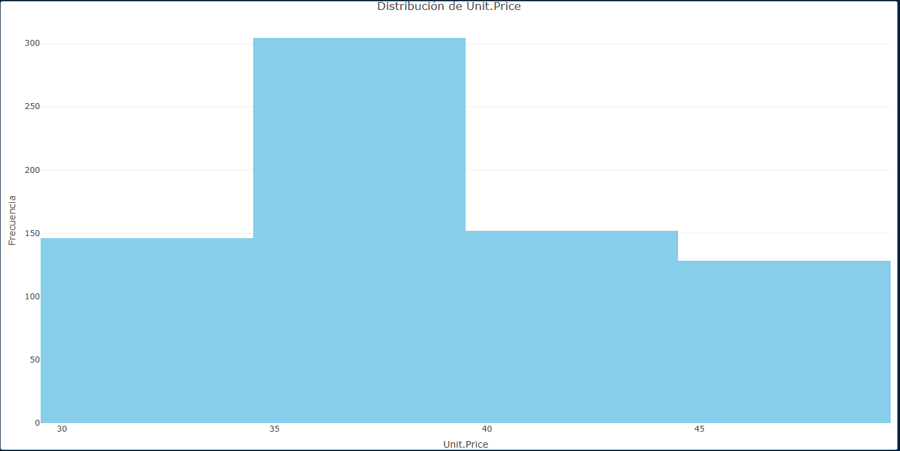
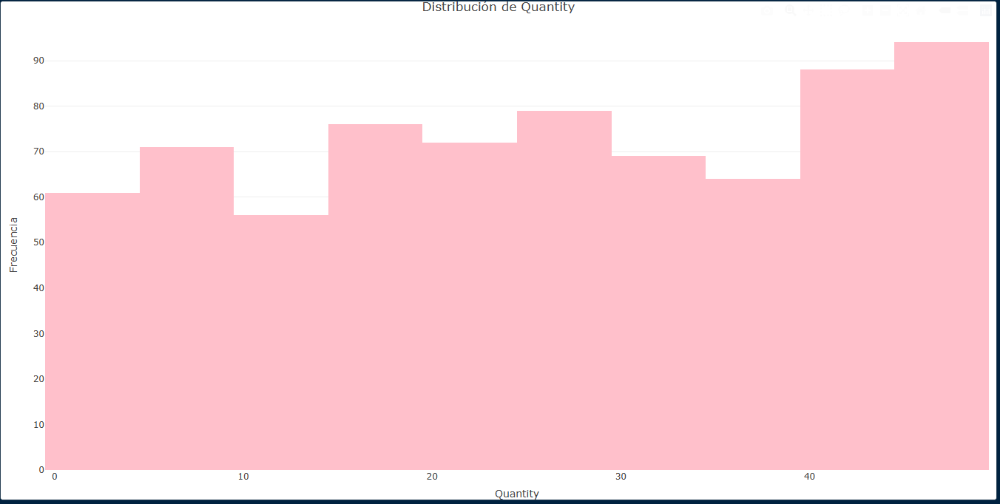
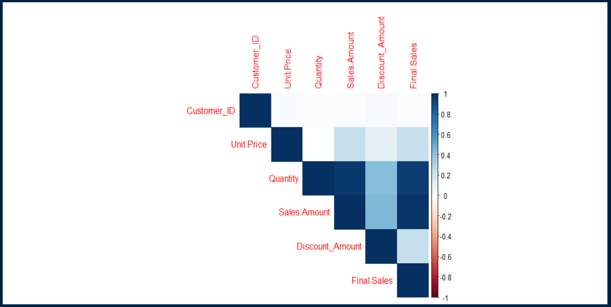
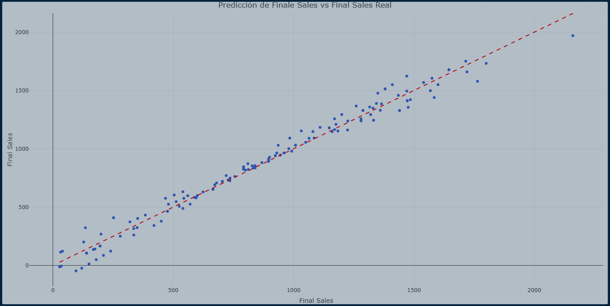

# ☕ Predicción de Ventas de Café con R

## Descripción del proyecto

Este proyecto desarrolla un análisis exploratorio de datos (EDA) y un modelo de regresión lineal para predecir las ventas finales de una cafetería utilizando R.

A través de técnicas de limpieza de datos, análisis estadístico y visualización, se identifican los factores que influyen en las ventas y se construye un modelo predictivo que permite estimar el valor de las ventas finales.

---

## Objetivo

Desarrollar un modelo de regresión lineal que permita predecir las ventas finales (`Final Sales`) utilizando variables relacionadas con el precio unitario, la cantidad vendida y los descuentos aplicados.

---

## Herramientas utilizadas

- R
- RStudio
- dplyr
- plotly
- corrplot

---

## Metodología

El proyecto se desarrolló siguiendo las siguientes etapas:

1. Importación del conjunto de datos.
2. Exploración y comprensión de la información.
3. Limpieza y preparación de los datos.
4. Estadísticas descriptivas.
5. Visualización de las variables principales.
6. Análisis de correlación.
7. Selección de variables para el modelo.
8. División de datos en entrenamiento (80%) y prueba (20%).
9. Entrenamiento de un modelo de regresión lineal.
10. Evaluación del modelo mediante métricas de desempeño.

---

## Variables utilizadas

El modelo utiliza las siguientes variables predictoras:

- Unit Price
- Quantity
- Discount Amount

Variable objetivo:

- Final Sales

---

## Evaluación del modelo

El desempeño del modelo fue evaluado mediante:

- RMSE (Root Mean Squared Error)
- MAE (Mean Absolute Error)
- Coeficiente de determinación (R²)

---

## Habilidades demostradas

Durante el desarrollo de este proyecto se aplicaron conocimientos en:

- Limpieza de datos
- Análisis exploratorio (EDA)
- Visualización de datos
- Análisis de correlación
- Modelado estadístico
- Regresión lineal
- Evaluación de modelos predictivos
- Comunicación de resultados

---

## Archivos del proyecto

- `Proyecto_Karolayn_Gutierrez.Rmd`
- `Proyecto_Karolayn_Gutierrez.html`
- `DatasetForCoffeeSales2.csv`

---

# Vista previa del análisis

## Distribución del precio unitario

---

## Distribución de la cantidad

---

## Matriz de correlación

---

## Predicción del modelo

---

## Conclusiones

Los resultados muestran que variables como el precio unitario, la cantidad vendida y los descuentos presentan una relación significativa con las ventas finales.

El modelo de regresión lineal permitió estimar las ventas con un desempeño evaluado mediante métricas objetivas, constituyendo una base para futuros modelos predictivos y análisis orientados a la toma de decisiones.
